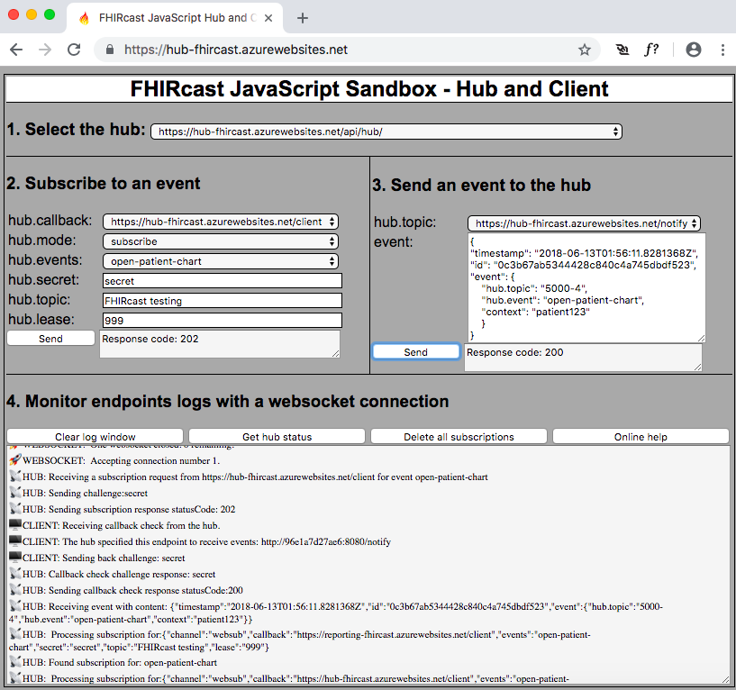

# FHIRcastJS
JavaScript stack (Node.js) sandbox for FHIRcast

This is a WIP implementation of the FHIRcast proposal.  Missing features required to comply to the proposal are described in the issues list.   

FHIRcast is an HL7 specification designed to provide a lightweight, inexpensive and http-based application context synchronization standard. Find out more at fhircast.org: [http://fhircast.org].

The first communication channel defined by FHIRcast is the W3C WebSub RFC [https://www.w3.org/TR/websub/].  This model defines a "hub" that receives "subscribtions" from clients for specific events.  Client subscribe to events by sending the hub the location where they want to receive the events (hub.callback). The hub then performs a 'safety check' by asking the client about a common secret. In the same message, the hub also sends to the client the location where the client can send new events to be broadcasted (hub.topic).  If this step succeeds, the hub will start forwarding events to the client.

# Usage
1. Select the hub that you want to connect to.
2. Select the client endpoint (hub.callback) that will receive the events and then send a subscription request with the send button.  The hub response will be shown in the gray box.
3. Send an event to the endpoint specified by the hub in the callback check (hub.topic). The hub response will be shown in the gray box.
4. You can monitor the hub and client endpoints in this text area. The log entries starting with '📡HUB:' and '🖥️CLIENT:' describe backend messages relevant to the standard.  Frontend messages can be seen in your browser console using the browser developer tools. The log entries starting with '🔥UI:' and '🚀WEBSOCKET:' are not relevant to the standard.  They provide information about the sandbox internal operations.  
   
# Troubleshooting
1. The log text area does not display any messages:  Possibly the websocket connection between your browser and the hub is not working.  There could be a proxy server in your route that needs a software update or configuration change to support the websocket 'upgrade' header.  Another possibility is that you are using more websockets then your deployment allows.  For example, the cheapest azure deployment specifies a maximum of 5 sockets.
2. The emojis are black and white:  Windows 7 does not support color emojis.

Installation
========================================
On Windows or MacOS:
1. Install node at http://nodejs.org.
2. Install npm, the node package manager, at http://npmjs.org.
3. Clone or download the github and run "npm install" in its directory.  This will install the modules defined in package.json.
4. Run with "node index.js".  This starts the endpoints for the hub and the client.
5. Navigate your browser to "http://localhost:3000/" to access the UI.

VScode [https://code.visualstudio.com/] can be used on MacOS and Windows for editing and debugging.

# Program Description

There are three files:  endpoints.js, frontend.html and package.json.

The endpoints.js file provides all listening (client and hub) endpoints using Node.js with the express module.  

The frontend.html file is the client UI that triggers the client subscription requests and performs client event notifications to the hub.

You can use the sandbox as a client or a hub or both.

## Endpoints description
### Server (hub) endpoints
"/api/hub": POST with form query string to receive subscription requests from the clients
 
 "/notify": POST with JSON payload to receive events from the clients 

### Client endpoints

"/client": POST with JSON payload to receive events and subscribtion cancelations from the hub.

"/client": GET with standard query string to receive callback check from the hub. 

### Sandbox endpoints (not in the standard)

"/": GET with HTML/JavaScript (frontend.html file) to provide the web page to subscribe and post events to the hub.

"/log": (on ws not http), Websocket to broadcast the server side logs to the client browser.

